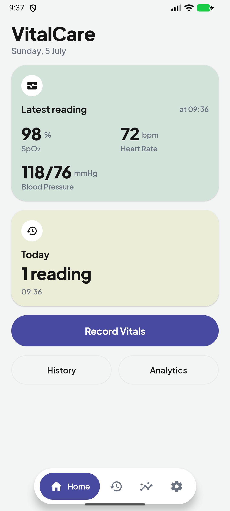
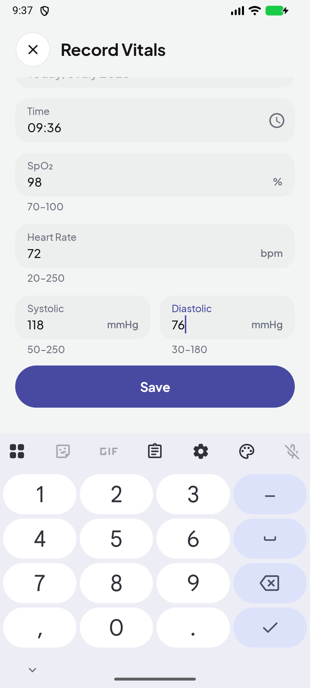
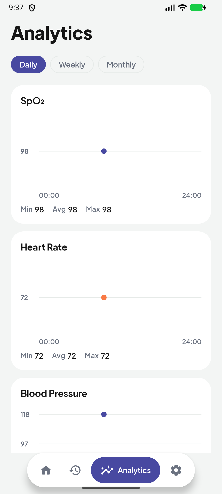
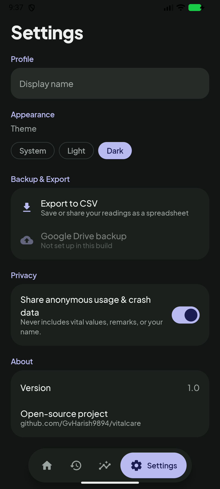

# VitalCare

**A local-first patient-vitals app for Android and iOS** — record SpO₂, heart
rate, and blood pressure in seconds, keep every reading on your device, and
see your trends over time. No account. No sign-up. No backend.

Built with **Kotlin Multiplatform + Compose Multiplatform**: one shared
codebase for business logic *and* UI on both platforms.

| Dashboard | Record | Analytics | Dark theme |
|---|---|---|---|
|  |  |  |  |

## Why VitalCare

- **Grandparent-proof** — big numerals, one clear action per screen, ≥48 dp
  touch targets, high-contrast text everywhere.
- **Local-first, private by default** — readings live in an on-device Room
  database. Nothing leaves your phone unless *you* export or back up.
- **Works offline forever** — recording, history, and analytics never touch
  the network.

## Features

- **Record vitals** with validation (SpO₂ 70–100 %, HR 20–250 bpm,
  BP 50–250 / 30–180 mmHg) and optional remarks
- **Dashboard** with your latest reading and today's summary, updating live
- **History** grouped by day with filters (Today / Week / Month) and
  remarks search — today's readings can be edited or deleted, past days are
  read-only by design
- **Analytics** — daily, weekly, and monthly trend charts with min/avg/max
  per vital
- **CSV export** — share or save your data as a standard RFC 4180
  spreadsheet, any time, no account needed
- **Google Drive backup** *(optional, off by default)* — one JSON snapshot in
  your own Drive's hidden app folder; restore **merges** and never deletes
- **Light/dark theme**, optional display name — that's the entire settings
  surface

## Building

A fresh clone builds and runs with **zero configuration**:

```bash
# Android
./gradlew :androidApp:assembleDebug

# iOS — open iosApp/ in Xcode and run
# (the Shared framework is built by Gradle as part of the Xcode build)
```

Tests:

```bash
./gradlew :shared:testAndroidHostTest        # JVM
./gradlew :shared:iosSimulatorArm64Test      # iOS simulator
```

## Optional: enabling Google Drive backup

The Drive feature ships disabled ("Not set up in this build") because it
needs an OAuth client that each fork supplies itself — no shared secret is
committed. See [CONTRIBUTING.md](CONTRIBUTING.md#optional-google-drive-backup)
for the 3-step setup. Everything else in the app works without it.

## Privacy

- Vitals, remarks, and your name **never leave the device** except through
  the export/backup actions you trigger yourself; Drive backups go only to
  *your* Google account (`drive.file` scope — the app can't see anything else
  in your Drive).
- The repo contains a Firebase config for **crash/usage telemetry only**
  (client identifiers, not secrets). The telemetry layer is currently a
  no-op stub; when enabled it is PHI-free by design and can be turned off in
  Settings → Privacy.

## Architecture

`shared/` holds everything: Clean Architecture (presentation / domain / data),
MVVM with immutable UI state, Room KMP as the single source of truth, Koin DI,
type-safe Compose Navigation, and a hand-rolled Canvas chart. Platform code is
limited to thin `expect`/`actual` seams (database builder, file export, Drive
auth, background scheduling). The full spec lives in [`.plan/`](.plan/) —
start with [`00-overview.md`](.plan/00-overview.md).

## License

[Apache-2.0](LICENSE). Bundled [Plus Jakarta Sans](https://github.com/tokotype/PlusJakartaSans)
is licensed under the [SIL OFL 1.1](shared/src/commonMain/composeResources/font/OFL.txt).
